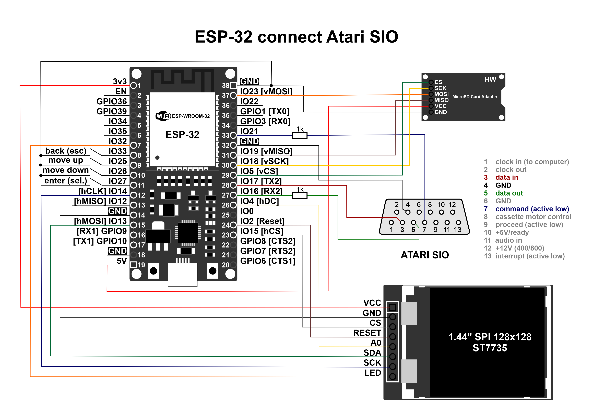

# About project

Astarta-ESP32 is a hardware emulator of some devices for ATARI 8bit:

- four independent disk drives with an opportunity read/write (D1-D4);

- tape recorder emulator with the ability to (only) read at standard speed; 

- real time clock (RTC) via APE TIME protocol (supported by *SpartaDOS*).


This implementation is the second version of the project and is based on the ESP-WROOM-32 microcontroller. The first version was implemented based on the Arduino DUE board. In addition to the ESP32 board itself, the ST7735 display, an SD card module, four buttons (for navigation), a pair of resistors for pairing 3.3 and 5 volts, and, of course, a SIO connector for connecting to an Atari computer are used.

In addition to emulating Atari interfacing devices, the ESP32 can:

- connect to a dedicated WiFi hotspot with a password;

- synchronize the internal clock with an NTP server on the Internet;

- provide real-time access to the SD card through the implementation of an FTP server.

The FTP server allows you to upload, download, rename, delete both files and directories. There are some restrictions when using ftp. Since, as it turned out, there is no single ftp standard for displaying a list of files, it is likely that some ftp clients may not correctly display a list of files. For example, Total Commander works correctly, creates and deletes files, and displays the correct creation date. There is also a restriction on the characters used, only ASCII is supported, however there are no restrictions on the use of spaces and long file names, the main thing is that the SD card is formatted in FAT32 format.

At the moment, several disk image formats are supported: ATR, XFD, partially PRO format (2 of 5 types of protection), as well as XEX pseudo-format (during mounting, a micro-floppy disk is created to which this executable file is “pasted”). There are also plans to support the ATX, DCM, SCP formats, but so far these are just blanks (dummy) for the future. Files in the standard CAS format are supported for loading cassettes.

Now the project is at the pre-alpha stage. This means that the product is not finished and everything is not even in test mode, but rather at the stage of creative search for solutions. The code may not be optimized, and there may be errors in the work. But in any case, you can already build it yourself, take part in testing and help make this project better.

# Construct

As mentioned above, to assemble the construction, you will need the ESP-WROOM-32 board. Perhaps other versions of the boards are also suitable, the main thing is that they are not simplified (with a lesser number of pins). Otherwise, you will have to make changes to the code yourself and reassign the numbers of connected pins.



To work with an SD card, standard SPI pins are used: IO23 - vMOSI, IO19 - vMISO, IO5 - vCS, IO18 - vSCK, and, accordingly, ground and power. My adapter uses a 5 to 3.3v converter, so it is connected to the 5v pin. If your adapter does not have such a converter, you should connect the output to 3.3v, otherwise it will lead to damage to the devices.


And to connect the display, a second SPI (hSPI) is used with the corresponding pins: IO13 - hMOSI, IO15 - hCS, IO4 - hDC, IO14 - hCLK, plus additional signals: IO2 - Reset and IO32 - LED (display backlight). Also, for the display to work, you must connect the ground and power 3.3v.


Interaction with Atari SIO occurs through the second communication port (RX2/TX2). Zero (RX0 / TX0) is used to interact with the PC and upload firmware to the ESP32. If your ESP32 board has only two ports, then you will have to reconnect the corresponding pins and make changes to the code.

For ATARI SIO, the 3.3v level is enough, so we can directly connect the DATA IN signal to IO17[TX2], the COMMAND signal to GPIO8[CTS2] without any problems. But for ESP32, the level of 5v is critical, so it must be limited. To do this, we will pass the DATA OUT signal through a block of resistors (values of 1 and 2 kOm) between IO16[RX2] and ground.

To navigate through the menu sections, four buttons are used, which are connected to the corresponding signals: IO33 - Back (Cancel), IO25 - Up, IO26 - Down, IO27 - Select. As shown by a little experience of use, such navigation leaves much to be desired. In large lists, you have to press the same button (up/down) many times to find the desired file. Therefore, there are ideas to try using a micro-joystick or even an encoder.


# Compiling & Flashing

To compile the code with subsequent firmware, you can use the same Arduino IDE. To do this, you need to [download](https://www.arduino.cc/en/software) and install the latest version from the official site (at the time of writing, I have version 2.0.3 installed). 

After installation, you need to open the IDE settings (File→Preference) and paste the URL into «Additional boards manager URLs:» — https://raw.githubusercontent.com/espressif/arduino-esp32/gh-pages/package_esp32_index.json


Then open the board manager (icon on the left panel) and install the board «esp32 by Espressif Systems»:


After installing all the necessary components, the IDE is ready to go. Select the board: Tools→Board:→esp32→ESP32 Dev Module. After that, we connect the board to the computer using a USB cable and we should have the corresponding COM port, in my case it is COM3.


If this does not happen, it is quite possible that drivers need to be installed for the board (Silicon Labs CP210x USB to UART Bridge), it is possible that the board conflicts with some device using the exact same COM port name.


But we will assume that you did not have any problems installing the board, and everything is ready for compiling and uploading the firmware. To do this, select "Sketch → Upload" or simply click on the round button with an arrow to the right. After the sketch is successfully compiled, the following message will appear with “running” dots:


At this point, you need to gently press the small "boot" button on the ESP32 board once, after which the firmware will continue to upload. In my practice, there were cases when the “boot” button had to be held for a long time until the download started. And in the latest version, you don’t have to press the “boot” button, and the firmware immediately loads itself. With what it is connected, it is difficult to answer, but it is worth bearing in mind.

If everything went well and you connected all the pins correctly, you will get a splash screen with the build version.


# Setup & Control

As noted earlier, to work, you need to format the SD card in FAT32 format, and copy the “astarta.cfg” configuration file to the root. At this stage, it consists of only a few lines in the form of a key=value pair:

```
ssid=PUT_YOUR_SSID_ID_HERE
password=PUT_YOUR_WIFI_PASS_HERE
hostname=astarta-esp32
ftpLogin=user
ftpPass=password
```

- ssid - this is the name of your Wi-Fi hotspot to connect to

- password - respectively the password for Wi-Fi

- hostname - device network name

- ftpLogin & ftpPass - these parameters are used when logging in to ftp.

Next, you need to press the "Select" button and, if the SD card is available, the configuration file has been read and processed successfully, the main menu will be displayed. Otherwise, an error message will be displayed on the screen. Along with this, an attempt will be made to connect to a Wi-Fi point (which will be indicated by the animation of the stripes). If the connection was successful, the signal level of the point will be displayed, as well as the clock. Otherwise there will be a red cross icon.


At this stage, the first 5 points are available: this is the installation of a floppy disk in drives D1-D4 and the installation of a cassette. The “Tools” and “Settings” sections are blanks for the future and are not yet selectable.


In order to insert (mount) a floppy disk or cassette, you need to use the up/down buttons to select the desired device, then press "Select" button and select the required file in the list that opens. The same goes for navigating through directories, to go to a higher level, select "..".


In order to insert another floppy image, you must repeat the above procedure. If you change your mind about insert a new image, then to exit, just press the "Back (Cancel)" button once. In order to eject an already installed image, it is also enough to select the necessary device and press "Back(Cancel)" once, and confirm your actions in the menu that opens.


Since booting from cassette to Atari takes a slightly different approach, you will have to do a few "extra" steps. Namely:

1. select device;

2. insert the required cassette image into it;

3. select the device again and while holding the "Select" button, press "Up" button.

After that, this window will open:


Next, turn on Atari with the "Select" and "Option" keys held down, press the "Return" key, after which we press the "Select" button on our device and enjoy the load.

# License

Source Copyright © 2022, 2025 Breeze\Fishbone and contributors. Distributed under the BSD License. See the file LICENCE.
