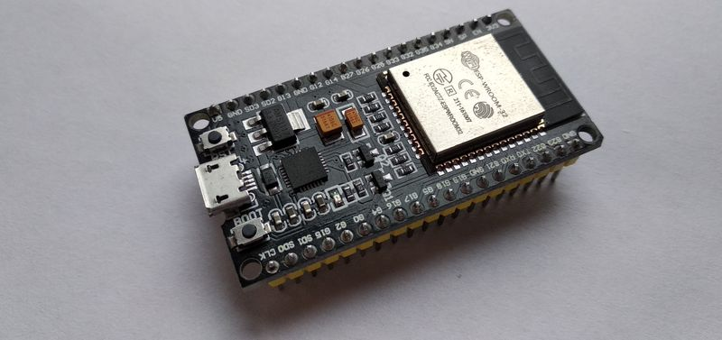
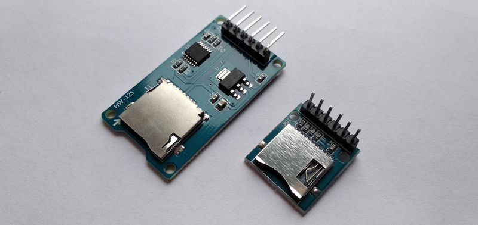
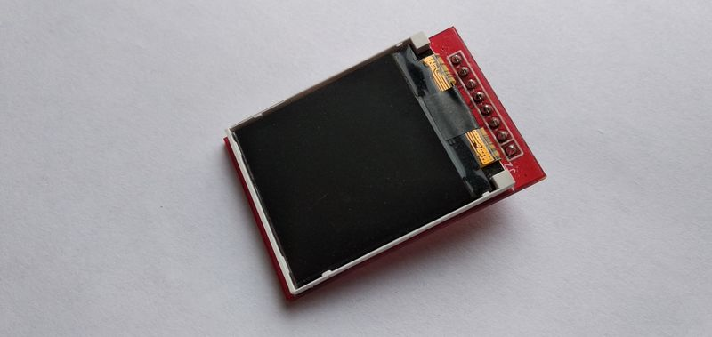
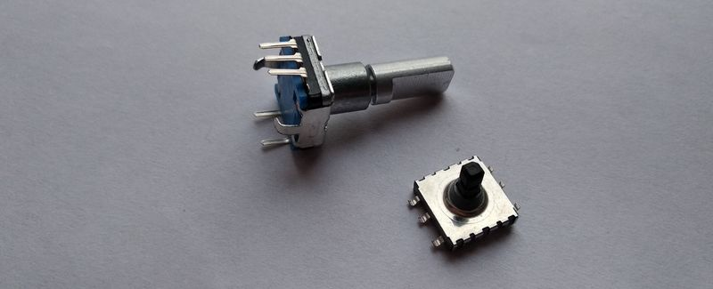
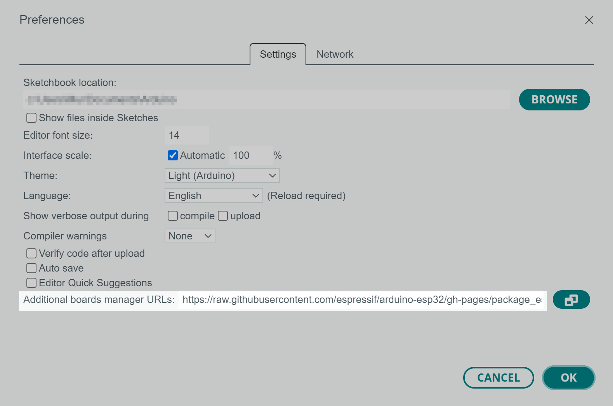
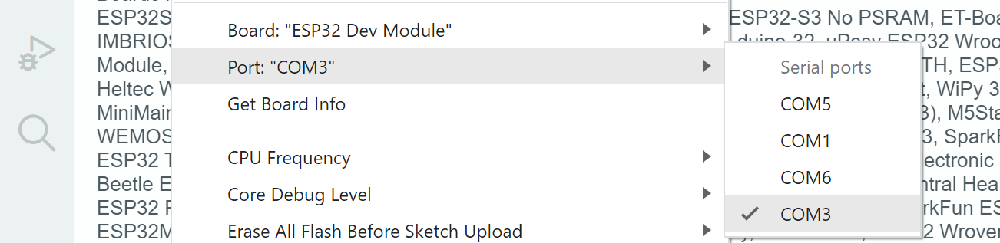
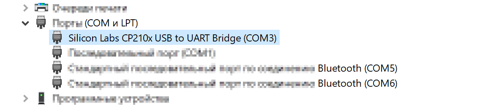
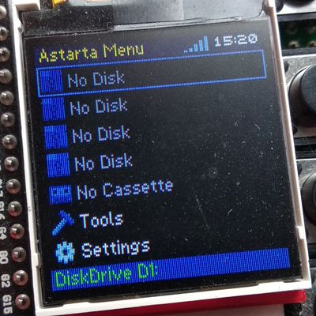
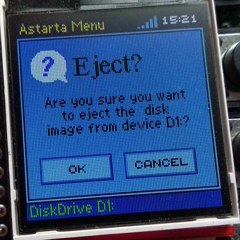

# О проекте

Astarta-ESP32 представляет собой аппаратный эмулятор некоторых устройств для ATARI 8bit:

- четыре независимых дисковода с возможностью записи (D1-D4);

- эмулятор магнитофона с возможностью (только) чтения с обычной скоростью; 

- часы реального времени (RTC) по протоколу APE TIME (поддерживается в *SpartaDOS*).



Данная реализация – уже вторая версия проекта и основана на базе микроконтроллера ESP-WROOM-32. Первая версия была реализована на базе платы Arduino DUE. Помимо самой платы ESP32 используется дисплей ST7735, модуль для SD карты, четыре кнопки (для навигации), пара резисторов для сопряжения 3.3 и 5 вольт, ну и, конечно же, SIO-разъём, для подключения к компьютеру Atari.

Помимо эмуляции устройств взаимодействия с Atari, ESP32 может:

- подключатся к выделенной WiFi-точке по паролю;

- синхронизировать внутренние часы с NTP-сервером в Интернет;

- обеспечивать доступ к SD-карте в реальном времени посредством реализации FTP-сервера.

FTP-сервер позволяет загружать, скачивать, переименовывать, удалять как файлы, так и директории. При использовании ftp есть некоторые ограничения. Поскольку, как выяснилось, нет единого ftp-стандарта при отображении списка файлов, велика вероятность, что некоторые ftp-клиенты могут некорректно отображать список файлов. Например, Total Commander работает корректно, создаёт и удаляет файлы и отображает правильную дату создания. Так же есть ограничение на используемые символы, поддерживаются только ASCII, однако нет ограничений на использование пробелов и длинных имён файлов, главное, чтобы SD-карта была отформатирована в формате FAT32.

На данный момент поддерживаются несколько форматов образов дисков: ATR, XFD, частично формат PRO (2 из 5 типа защит), а также псевдо-формат XEX (при монтировании создаётся микро-дискета, к которой «доклеивается» данный исполняемый файл). Так же есть в планах поддержать форматы ATX, DCM, SCP, но пока это только заготовки (пустышки) на будущее. Для загрузки кассет поддерживаются файлы в стандартном формате CAS.

Сейчас проект находится на стадии pre-alpha. Это означает, что продукт не закончен и всё находится даже не в тестовом режиме, а скорее на этапе творческого поиска решений. Код может быть не оптимизирован, а также возможны ошибки в работе. Но в любом случае, вы можете уже собрать это самостоятельно, принять участие в тестировании и помочь сделать этот проект лучше.

# Конструкция

Как уже было сказано выше, для сборки конструкции понадобится плата ESP-WROOM-32. Возможно, подойдут и другие версии плат, главное, чтобы они не были упрощёнными (с малым количеством выводов). В противном случае вам придётся самостоятельно вносить правки в код и переназначать номера подключаемых выводов.


Для работы с SD-картой используются стандартные выводы SPI: IO23 - vMOSI, IO19 - vMISO, IO5 - vCS, IO18 - vSCK, ну и, соответственно, земля и питание. В моём адаптере используется преобразователь 5 в 3.3в, поэтому она подключена к выводу 5в. Если в вашем адаптере такого преобразователя нет, следует подключать вывод к 3.3в, в противном случае это приведёт к поломке устройств.



А для подключения дисплея используется второй SPI (hSPI) с соответствующими контактами: IO13 - hMOSI, IO15 - hCS, IO4 - hDC, IO14 - hCLK, плюс дополнительные сигналы: IO2 - Reset и IO32 - LED (подсветка дисплея). Так же для работоспособности дисплея необходимо подключить землю и питание 3.3в.



Взаимодействие с Atari SIO происходит через второй коммуникационный порт (RX2/TX2). Нулевой (RX0/TX0) пользуется для взаимодействия с PC и загрузки прошивок в ESP32. Если в вашей плате ESP32 только два порта, то придётся переподключать соответствующие контакты и внести изменения в код.

Для ATARI SIO вполне достаточно уровня 3.3в, поэтому без проблем можем подключать напрямую сигнал DATA IN к IO17[TX2], сигнал COMMAND к GPIO8[CTS2]. А вот для ESP32 уровень в 5в критичен, поэтому его необходимо ограничить. Для этого сигнал DATA OUT мы пропустим через блок резисторов (номиналами 1 и 2 кОм) между IO16[RX2] и землёй.

Для навигации по разделам меню пользуются четыре кнопки, которые подключены к соответствующим сигналам: IO33 - Назад (Отмена), IO25 - Вверх, IO26 - Вниз, IO27 - Выбор. Как показал небольшой опыт пользования, такая навигация оставляет желать лучшего. В больших списках приходится помногу раз нажимать одну и ту же кнопку (вверх/вниз) для поиска нужного файла. Поэтому есть задумки попробовать использовать микро-джойстик или даже энкодер.



# Компиляция & Прошивка

Для компиляции кода с последующей прошивкой можно воспользоваться всё той же Arduino IDE. Для этого необходимо [скачать](https://www.arduino.cc/en/software) и установить последнюю версию с официального сайта (на момент написания материала у меня установлена версия 2.0.3). 

После установки, необходимо открыть настройки IDE (File→Preference) и вставить URL в «Additional boards manager URLs:» — https://raw.githubusercontent.com/espressif/arduino-esp32/gh-pages/package_esp32_index.json



Затем открыть менеджер плат (пиктограмма на левой панели) и установить плату «esp32 by Espressif Systems»:


После установки всех необходимых компонентов, IDE готова к работе. Выбираем плату: Tools→Board:→esp32→ESP32 Dev Module. После чего подключаем плату к компьютеру с помощью USB-кабеля и у нас должен появится соответствующий COM-порт, в моём случае это COM3.



Если этого не произошло, вполне возможно, что для платы необходимо установить драйвера (Silicon Labs CP210x USB to UART Bridge), возможен вариант, когда плата конфликтует с каким-либо устройством, использующим точно такое же имя COM-порта.



Но будем считать, что у вас не возникло проблем с установкой платы, и всё готово к компиляции и загрузке прошивки. Для этого надо выбрать «Sketch→Upload» или просто нажать на круглую кнопку со стрелкой вправо. После того, как скетч успешно скомпилируется, появится вот такое сообщение с «бегущими» точками:


В этот момент, нужно однократно аккуратно нажать маленькую кнопку «boot» на плате ESP32, после чего продолжится загрузка прошивки. В моей практике были случаи, когда кнопку «boot» необходимо было держать продолжительное время, пока не начнётся загрузка. А в последней версии кнопку «boot» нажимать не приходится, и прошивка сразу загружается сама. С чем это связано затрудняюсь ответить, но стоит иметь ввиду.

Если всё прошло успешно, и вы соединили все выводы правильно, вы получите заставку на экране с версией сборки.


# Настройка & Управление

Как уже было замечено ранее, для работы необходимо отформатировать SD-карту в формате FAT32, а в корень скопировать конфигурационный файл «astarta.cfg». На данном этапе он состоит всего из нескольких строк в виде пары ключ=значение:

```
ssid=PUT_YOUR_SSID_ID_HERE
password=PUT_YOUR_WIFI_PASS_HERE
hostname=astarta-esp32
ftpLogin=user
ftpPass=password
```

- ssid  - это название вашей Wi-Fi точки для подключения

- password - соответственно пароль для Wi-Fi

- hostname - сетевое имя устройства

- ftpLogin и ftpPass - эти параметры используются при входе на ftp.

Далее необходимо нажать кнопку «Выбор» и, если SD-карта доступна, файл конфигурации прочитан и успешно обработан, будет отображено главное меню. В противном случае на экране будет сообщение об ошибке. Наровне с этим будет осуществляется попытка подключения к Wi-Fi точке (о чём будет свидетельствовать анимация полосок). Если подключится удалось успешно, то будет отображаться уровень сигнала точки, а также часы. В противном случае будет красный крестик.



На данном этапе доступны первых 5 пунктов: это установка дискеты в дисководы D1-D4 и установка кассеты. Разделы «Tools» и «Settings» – заготовки на будущее и пока не выбираются.


Для того что бы установить дискету или кассету, необходимо кнопками вверх/вниз выбрать нужное устройство, затем нажать «Выбор» и в открывшимся списке выбрать необходимый файл. Так же происходит и навигация по директориям, для выхода на уровень выше нужно выбрать «..».


Для того что бы установить другой образ дискеты, необходимо повторить вышеописанную процедуру. Если вы передумали устанавливать новый образ, то для выхода достаточно однократно нажать кнопку «Назад (Отмена)». Для того что бы извлечь уже установленный образ также достаточно выбрать необходимое устройство и однократно нажать «Назад (Отмена)», а в открывшимся меню подтвердить свои действия.



Поскольку для загрузки с кассеты на Atari применяется несколько иной подход, то придётся сделать несколько «лишних» действий. А именно:

1. выбрать устройство;

2. установить в него необходимый образ кассеты;

3. выбрать устройство ещё раз и удерживая кнопку «Выбор» нажать ещё «Вверх».

После чего откроется такое вот окошко:


Далее включаем Atari с зажатыми клавишами «Select» и «Option», нажимаем клавишу «Return», после чего на нашем устройстве жмём кнопку «Выбор» и наслаждаемся загрузкой.

# License

Source Copyright © 2022, 2025 Breeze\Fishbone and contributors. Distributed under the BSD License. See the file LICENCE.
